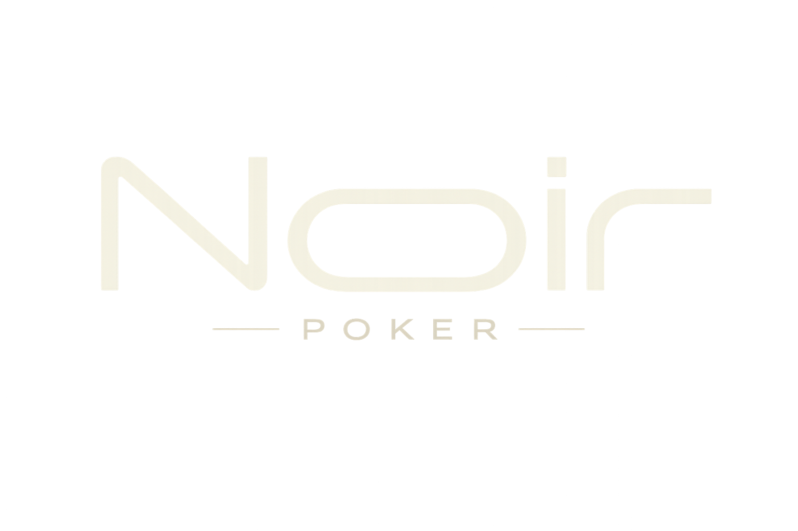
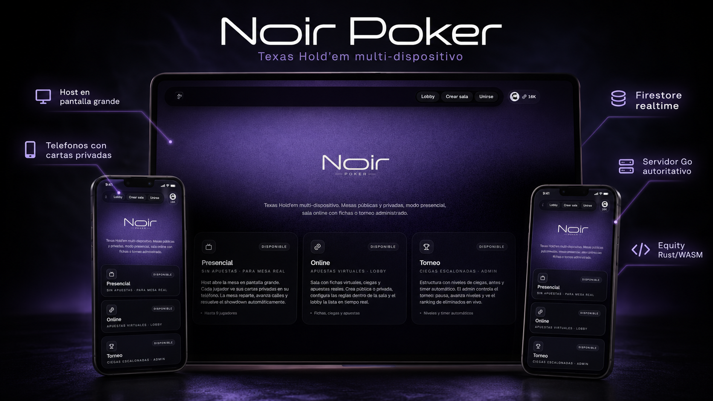

<div align="center">



# Contribuir a Noir Poker

Guía de trabajo, estándares técnicos y roadmap del proyecto.

[](README.md)
[](#roadmap)
[](server/README.md)

</div>

---



Este documento resume cómo contribuir sin romper las invariantes de juego, privacidad y sincronización. Para una visión de producto y arquitectura, empieza por [README.md](README.md). Para el plan específico del modo server-backed, revisa [docs/plan-migracion.md](docs/plan-migracion.md).

## Estado del proyecto

Noir Poker es jugable de punta a punta en los modos actuales:

| Área | Estado |
| --- | --- |
| Presencial | Completo para sala física: host, teléfonos, cartas privadas, reveal, showdown y equity host-only |
| Online legacy | Completo en features principales: apuestas, side pots, all-in run-it-N, chat, voz, economía y hand history |
| Torneo legacy | Funcional: niveles, pausa, avance manual, knockouts y ranking |
| Go server-backed | MVP avanzado: mano autoritativa, WebSocket, timer por turno, run-it-N básico, espectadores y lobby de salas activas |
| Migración a Go | En progreso: Go todavía no tiene paridad con el legacy |

La arquitectura actual mantiene dos caminos en paralelo:

- Legacy host-authoritative: `/host/normal`, `/play/normal/[code]`, `useNormalGame`, Firestore.
- Server-backed autoritativo: `/play/online/[code]`, `server/`, WebSocket, Render.

El objetivo técnico es llevar el camino server-backed a paridad antes de deprecar el legacy.

## Antes de empezar

1. Crea un fork o rama local desde `master`.
2. Instala dependencias con `npm install`.
3. Crea `.env.local` desde `.env.example`.
4. Usa un proyecto Firebase de pruebas; no desarrolles contra producción.
5. Corre el smoke test del flujo que vas a tocar.

```bash
npm install
cp .env.example .env.local
npm run dev
```

## Flujo de trabajo

| Rama | Uso |
| --- | --- |
| `master` | Rama principal, debe estar deployable |
| `feat/<nombre>` | Nueva funcionalidad |
| `fix/<nombre>` | Corrección de bug |
| `refactor/<nombre>` | Refactor sin cambio de comportamiento |
| `docs/<nombre>` | Documentación |
| `test/<nombre>` | Cobertura o fixtures |

Antes de abrir PR:

```bash
npm run lint
npm test
npm run build
```

Para cambios en `server/`:

```bash
cd server
go vet ./...
go build ./cmd/server
```

`go test ./...` corre en CI. En esta máquina Windows puede fallar por Smart App Control bloqueando binarios de test sin firmar.

## Commits

Formato recomendado:

```text
<tipo>(<scope opcional>): <descripción imperativa corta>

Cuerpo opcional con contexto y motivo.
```

| Tipo | Uso |
| --- | --- |
| `feat` | Nueva funcionalidad |
| `fix` | Corrección de bug |
| `refactor` | Refactor sin cambio observable |
| `perf` | Mejora de rendimiento |
| `docs` | Solo documentación |
| `style` | Formato, sin cambio lógico |
| `test` | Tests nuevos o ajustados |
| `chore` | Dependencias, config o CI |

Ejemplos:

```text
feat(betting): agregar straddle opcional
fix(firestore): reintentar snapshot tras desconexion
docs: actualizar roadmap de migracion go
```

## Convenciones técnicas

### TypeScript y React

- `strict: true`; evita `any` salvo justificación explícita.
- Usa `import type { ... }` para tipos.
- Imports absolutos vía `@/`.
- Componentes interactivos con `"use client"` al inicio.
- Hooks en `src/hooks/`; componentes agrupados por feature en `src/components/`.
- Todos los hooks deben ejecutarse antes de cualquier `return` condicional.
- Usa actualizaciones funcionales (`setX(prev => ...)`) cuando dependan del estado anterior.

### Next.js y Tailwind

- App Router vive en `src/app`.
- Una ruta pública existe cuando hay `page.tsx` o `route.ts`.
- Tailwind v4 usa tokens en `src/app/globals.css` con `@theme inline`.
- No hay `tailwind.config.js`.

### Firebase y realtime

- No llames `getFirestore()` directo desde componentes.
- Usa helpers de `src/lib/rooms.ts`, `src/lib/normalRooms.ts` y módulos relacionados.
- Mantén un solo punto de escritura de estado de sala por flujo.
- Evita writes dispersos desde varios componentes para el mismo documento.

### UI

- Copy visible en español.
- Iconos desde Lucide.
- Mantén el bundle liviano antes de agregar dependencias.
- Respeta `prefers-reduced-motion` en animaciones nuevas.

## Invariantes de privacidad

Estas reglas no son negociables:

| Invariante | Motivo |
| --- | --- |
| No guardar hole cards en documentos públicos | Evita filtración desde Firestore o snapshots compartidos |
| Equity, outs y fuerza de mano solo en host | Esa información no debe aparecer en vista de jugadores ni sobre la mesa |
| El jugador solo recibe sus cartas | Base de privacidad del modo teléfono y del modo server-backed |
| Campos nuevos deben clasificarse | Decide explícitamente entre público, host-only, owner-only o no-display |
| En Go, la lógica de juego vive en `server/internal/game` | El cliente solo renderiza estado y manda acciones |

## Smoke tests manuales

### Presencial

1. Abre `/host`.
2. Une dos jugadores desde `/play/CODIGO`.
3. Reparte, avanza calles, revela cartas y confirma showdown.

### Online legacy

1. Abre `/create` o `/host/normal`.
2. Une dos jugadores desde `/play/normal/CODIGO`.
3. Valida fold/check/call/raise/all-in.
4. Revisa side pots, historial, chat y salida de sala.

### Torneo

1. Abre `/host/torneo`.
2. Une jugadores desde `/play/normal/CODIGO`.
3. Valida niveles, pausa/reanudar, avance manual y eliminación.

### Server-backed Go

1. Corre el servidor local:

   ```bash
   cd server
   go run ./cmd/server
   ```

2. Configura:

   ```bash
   NEXT_PUBLIC_GAME_WS_URL=http://localhost:8080
   ```

3. Abre `/play/online` en dos pestañas o usa el CLI:

   ```bash
   npm run play -- MESA1 Ana
   npm run play -- MESA1 Beto
   ```

4. Reparte y confirma que cada cliente solo recibe sus cartas.

## Áreas recomendadas para contribuir

| Área | Buen primer paso |
| --- | --- |
| Tests | Casos adicionales en `handEval`, `betting`, `runIt`, `tournament` |
| UI | Accesibilidad, focus rings, estados vacíos, copy y responsive |
| Server Go | Economía real de stacks, categorías de mano, torneos completos, persistencia autoritativa |
| Historial | Persistencia de manos y replayer |
| Voz | TURN documentado y experiencia en redes restrictivas |
| Docs | Mantener README, CONTRIBUTING y plan de migración sincronizados |

## Roadmap

### Alta prioridad

| Feature | Estado | Notas |
| --- | --- | --- |
| Stats por sala en backend | Pendiente | Migrar `useStats`/`useHistory` desde localStorage a estado durable |
| Transferir host | Pendiente | Cambio de `hostUid` + listeners para continuidad de sala |
| Persistencia de manos | Parcial | Necesaria para replayer, HUD y stats avanzadas |
| Auditoría Firestore rules | Pendiente | Revisar privacidad, rate limits y writes de acciones |

### Migración Go

| Feature | Estado en Go | Comentario |
| --- | --- | --- |
| Mano completa | Hecho | Deal, betting, streets, showdown y side pots |
| WebSocket rooms | Hecho | Estado público + holes privados por asiento |
| Auth Firebase WS | Implementado, opcional | Depende de `FIREBASE_PROJECT_ID` en Render |
| Timer server-side | Hecho | Auto-check/auto-fold con deadline publicado al cliente |
| Economía/escrow | Hecho | Cash-out lee el stack final del Go (`GET /stacks`); XP/historial cuentan manos verificadas de Supabase; buy-in exige cuenta real |
| Lobby de salas online | Hecho básico | `GET /rooms` lista salas activas del hub; falta metadata rica |
| Run-it-N | Hecho básico | Configurable 1-3 runs desde creación; falta negociación/votación por mano |
| Historial y stats del server | Hecho | El Go escribe `online_hand_records` en Supabase con categoría real; el cliente solo lee |
| Torneos | Parcial | Go tiene escalado simple de ciegas; faltan niveles configurables, knockouts, ranking y payouts |
| Espectadores/cola | Hecho | Entrada observer-first; cupo de 9 asientos con fila por orden de llegada y promoción automática |
| Deprecar legacy | Bloqueado | Solo cuando Go alcance paridad |

### Producto y calidad

- Replayer de última mano.
- Export de historial desde HostDock.
- Podio y payouts configurables en torneos.
- PWA y soporte offline básico.
- Accesibilidad: `aria-live` en turno, foco visible, contraste.
- Bundle audit con `ANALYZE=true next build`.
- E2E para showdown con side pots.
- Firebase Emulator Suite en CI.

## Bugs conocidos

| Severidad | Descripción | Impacto |
| --- | --- | --- |
| Media | SeatPicker no aparece en modo Torneo | El jugador puede jugar; la selección visual de asiento queda limitada |
| Baja | Dealer button puede superponerse con fichas en mesa heads-up | Visual, no afecta lógica |
| Media | Render free duerme por inactividad | Cold start aproximado de un minuto (mitigado con keep-alive ping) |
| Baja | Reconexión con la sala llena te manda al final de la fila | El asiento se libera al desconectar entre manos; al volver entras a la cola |

## Documentos relacionados

- [README](README.md)
- [Plan de migración Go](docs/plan-migracion.md)
- [Architecture roadmap](docs/architecture-roadmap.md)
- [Servidor Go](server/README.md)
- [CLI](cli/README.md)
- [Voz WebRTC](docs/voice-setup.md)
- [Persistencia](docs/persistence-setup.md)
- [Backlog de seguridad](docs/security-backlog.md)
- [Auditoría QA](docs/qa-audit-2026-06-03.md)
