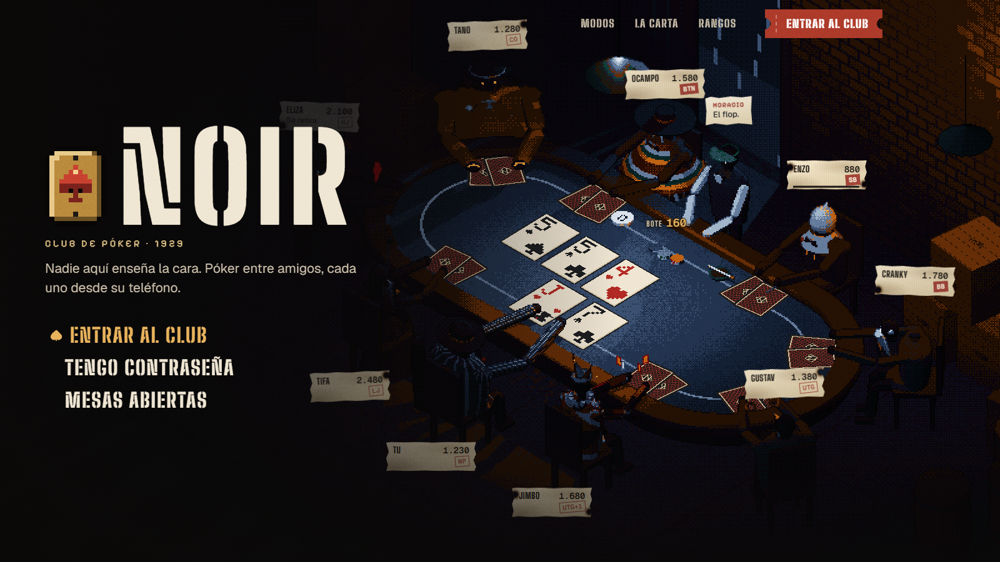
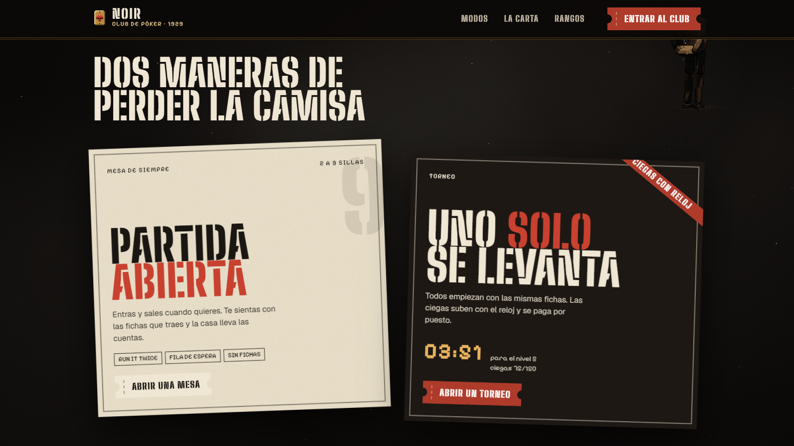
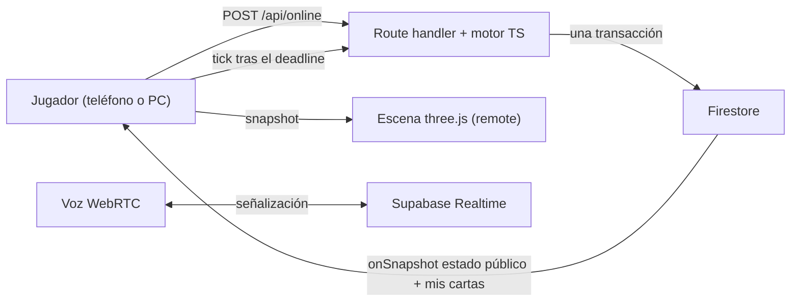

<div align="center">


# Noir Poker

Club de Texas Hold'em para jugar con amigos, cada uno desde su dispositivo, en una sala de juego de 1929 en pixel art 3D.

[](https://nextjs.org/)
[](https://react.dev/)
[](https://www.typescriptlang.org/)
[](https://firebase.google.com/)
[](public/noir/scene.html)
[](src/lib/online)

<br />

[El club](#el-club) · [Stack](#stack) · [Funcionamiento](#funcionamiento) · [Desarrollo](#desarrollo-local) · [Rutas](#rutas-principales) · [Deploy](#deploy)

</div>

---



Noir Poker es un juego, no una web: un club clandestino de 1929 donde cada amigo se sienta desde su teléfono o computador. La mesa es una escena three.js en pixel art; la información vive en el mundo en vez de en paneles: las sillas son cartas de papel con agujeros de bala, las apuestas y el bote van escritos con tiza sobre el paño, el crupier Horacio habla en papelitos rotos y el reloj del turno es un cigarro en el cenicero.

Detrás hay un backend autoritativo **serverless** en TypeScript: cada jugada es un `POST /api/online` que corre una transacción de Firestore. El mazo vive en el servidor y cada jugador recibe solo sus cartas. No hay ningún servidor aparte que mantener encendido.

## El club



| Modo | Qué es |
| --- | --- |
| **Partida abierta** | Cash game de 2 a 9 sillas. Entras y sales cuando quieres, te sientas con las fichas que traes y la casa lleva las cuentas. Con monedas (cuenta registrada) o **sin fichas** (recompras libres, invitados incluidos). |
| **Torneo** | Sit-and-go: todos empiezan igual, nadie se sienta tras el primer reparto, las ciegas suben con el reloj y el último con fichas se lo lleva todo. |

**La carta de la casa** (reglas configurables al estilo PokerNow desde el libro de la mesa):

- **Run it twice**: en un all-in la mesa vota (una vez / preguntar / dos veces); el desenlace se reparte lento a propósito, carta a carta, con foco sobre el ganador.
- **Reloj por turno** con banco de tiempo que se recarga cada N manos.
- **Ante y estructura de ciegas** por niveles, o ciegas fijas.
- **Reparto automático**: tras el showdown la mesa reparte sola la siguiente mano.
- **Aprobación del dueño** para sentarse (el buy-in queda en garantía al aprobar), expulsar, ausentarse, conejo (rabbit hunting) y libro de sesión.
- **Fila de espera**: mesa llena, miras desde la barra y te sientas por orden de llegada.
- **Voz en la mesa** P2P entre teléfonos (WebRTC).
- **Historial de manos** por showdown.
- **Invitaciones por enlace** (`/m/{código}`); el código sigue sirviendo como contraseña.

**Rangos**: siete escalones con emblema animado pintado en código (Peón, Timador, Sicario, Capo, Verdugo, Espectro, Noir), ganados con la experiencia que se cuenta en el servidor.

## Stack

| Capa | Tecnología | Uso |
| --- | --- | --- |
| Web | Next.js 16 App Router (Turbopack), React 19, TypeScript strict | Portada, panel del club, mesa online, perfil |
| Escena | three.js (importmap desde CDN) en `public/noir/scene.html` | Mesa pixel art 3D, puerta, personajes, selector; embebida en iframes y alimentada por snapshots |
| UI | Tailwind CSS v4, materiales Noir (`noir.css`), GSAP, Lucide | Tickets, placas de latón, papeles rotos; entradas CSS y GSAP solo para scroll |
| Realtime | Firebase Auth (Google / anónimo), Firestore | Estado público, cartas privadas, presencia, historial, economía |
| Juego online | Next.js API routes + Firestore transactions | Motor puro (`src/lib/online/engine.ts`): mazo, apuestas, side pots, run-it-N, torneos, reglas de la casa |
| Voz | Supabase Realtime, WebRTC, TURN opcional | Señalización P2P, mute, niveles de audio |
| Equity | Rust a WASM, Web Worker | Cálculo exacto y Monte Carlo para el panel del host |
| Calidad | ESLint 9, Vitest | Lint y pruebas del motor (incluye fuzz de conservación de fichas) |

## Funcionamiento



### Flujo de una mano

1. En `/jugar` eliges personaje y abres una mesa o torneo (o entras por código o enlace).
2. Entras como observador; "Sentarme" te sienta o te pone en la fila. Con monedas, el buy-in queda en garantía en la misma transacción que la silla.
3. El dueño reparte la primera mano; después la mesa reparte sola tras cada showdown.
4. Cada acción va a `/api/online`: el motor la valida, liquida monedas y publica el estado público, las cartas de cada uno (`holes/{uid}`) y el registro de la mano.
5. No hay proceso de fondo: el reloj del turno lo empujan los clientes con `tick` cuando vence el `deadline` público (el servidor vuelve a comprobar la hora); la presencia detecta desconexiones.
6. El cliente traduce el estado a un snapshot (`src/lib/noirScene.ts`, puro y testeado) y la escena anima la diferencia: reparto, fichas, tablero, all-in a oscuras, ganadores.

### Privacidad y seguridad de juego

- El mazo y las cartas ajenas viven en `onlineRooms/{code}/private/engine`, cerrado a los clientes por `firestore.rules`.
- Las hole cards nunca van al documento público; cada jugador lee solo `holes/{uid}`.
- Equity, outs y fuerza de mano son solo para el panel del host; nunca sobre una silla.
- La economía es atómica y está limitada por el libro de la mesa (`roomLedgers/online-{code}`); las mesas con monedas exigen cuenta no anónima.
- `next.config.ts` cierra el framing (`frame-ancestors 'none'`) salvo `/noir/*`, que la propia app embebe.

## Desarrollo local

### Requisitos

- Node.js 21 o superior.
- Proyecto Firebase con Firestore y Auth (Google + anónimo).
- Opcional para desarrollo local sin tocar producción: Java 11+ y `firebase-tools` (Emulator Suite).
- Rust + `wasm-pack` solo si vas a recompilar el motor de equity.

### Instalación

```bash
npm install
cp .env.example .env.local
npm run dev
```

La app queda disponible en `http://localhost:3000`.

### Variables de entorno

El archivo base es `.env.example`. Las variables `NEXT_PUBLIC_*` se incluyen en el bundle del cliente; las demás se leen solo desde servidor o procesos externos.

| Variable | Uso |
| --- | --- |
| `NEXT_PUBLIC_FIREBASE_*` | Firebase web app, Firestore y Auth |
| `FIREBASE_ADMIN_*` | Admin SDK para economía/XP en route handlers |
| `NEXT_PUBLIC_SUPABASE_URL`, `NEXT_PUBLIC_SUPABASE_ANON_KEY` | Señalización de voz por Supabase Realtime |
| `NEXT_PUBLIC_TURN_*` | TURN opcional para WebRTC en redes restrictivas |
| `NEXT_PUBLIC_FIREBASE_AUTH_DOMAIN=self` | Opcional: sirve el helper de Auth desde el propio dominio (ver `docs/auth-setup.md`) |

### Comandos

```bash
# Web Next.js
npm run dev
npm run build
npm run start

# Todo local contra Firebase Emulator Suite (Auth + Firestore)
npm run dev:emu

# Calidad
npm run lint
npm test
npm run test:watch

# Motor Rust/WASM
cd engine
wasm-pack build --target web --out-dir pkg
```

### Verificacion rapida

Para confirmar que el repo sigue sano tras un cambio chico:

```bash
npm run lint
npm test
npm run build
```

### Smoke test

1. Ejecuta `npm run dev` (o `npm run dev:emu` para no tocar producción).
2. Abre `/` y entra al club; en `/jugar` elige personaje.
3. Abre una mesa **sin fichas**: la mesa se abre en `/play/online/CODIGO`.
4. En otra pestaña o teléfono, entra con el código o el enlace `/m/CODIGO` y siéntate.
5. Reparte la primera mano y confirma que la siguiente se reparte sola.

## Rutas principales

| Ruta | Descripción |
| --- | --- |
| `/` | Portada Noir: mesa en vivo, modos, carta de la casa, rangos y la puerta del club |
| `/login` | Puerta de entrada (Google o invitado) |
| `/jugar` | Panel del club: personaje, mesa rápida, abrir mesa o torneo, entrar por código, mesas abiertas (`?p=open\|tourney\|code\|list`) |
| `/play/online/[code]` | La mesa: escena 3D, riel de acciones, voz, chat y libro de la mesa |
| `/m/[code]` | Invitación por enlace; redirige a la mesa |
| `/perfil` | Perfil, monedas, rango y personaje |
| `/api/online` | Una jugada = una transacción (motor + economía + escrituras) |
| `/api/economy` | Monedas y XP autoritativos |

Rutas heredadas del modo host (aún funcionan, sin rediseñar): `/create`, `/join`, `/host/normal`, `/host/torneo`, `/play/normal/[code]`, `/admin/[code]`. `/lobby` y `/play/online` redirigen a `/jugar`.

## Estructura

```text
poker-sim/
  src/
    app/                 Rutas App Router y noir.css (materiales y tokens)
    components/
      landing/           Portada Noir: escena, carteles, carta, rangos, puerta
      noir/              NoirTable, NoirActionRail, NoirMenu, CharacterPicker
      voice/             Panel y audio de voz WebRTC
    hooks/               Auth, mesa online, presencia, voz, equity
    lib/
      online/            Motor puro, protocolo, servidor y cliente del modo online
      noirScene.ts       Adaptador estado -> snapshot de la escena
      noirCast.ts        Personajes y URLs de la escena
    workers/             Equity worker
  public/noir/           Escena three.js pixel art (scene.html)
  engine/                Motor Rust/WASM de equity
  docs/                  Arquitectura, auth, voz, seguridad y capturas
  firestore.rules        Reglas de seguridad Firestore
```

## Convenciones

- App Router vive en `src/app`; una ruta pública existe cuando hay `page.tsx` o `route.ts`.
- La UI interactiva usa `"use client"` y se organiza por feature en `src/components`.
- Imports absolutos con `@/`.
- Tailwind v4 usa tokens en `src/app/globals.css` y `src/app/noir.css`; no hay `tailwind.config.js`.
- Pantallas Noir: cada control es un objeto de la sala (ticket, placa de latón, papel), nada de chrome web redondeado. Ver `DESIGN.md` y `CLAUDE.md`.
- Las reglas del juego viven solo en `src/lib/online/engine.ts`; el cliente renderiza y envía acciones.
- Los componentes no llaman `getFirestore()` directamente; usan helpers de `src/lib`.
- El estado de sala tiene una fuente de verdad por flujo.
- El copy visible de la aplicación está en español.
- Los iconos de UI salen de Lucide.

## Deploy

### Web en Vercel

1. Importa el repo en Vercel.
2. Configura `NEXT_PUBLIC_FIREBASE_*`, `FIREBASE_ADMIN_*` y Supabase (voz).
3. Ejecuta deploy. Vercel detecta Next.js automáticamente. El modo online corre en las mismas funciones serverless: no hay servidor aparte.

### Reglas Firestore

```bash
firebase deploy --only firestore:rules
```

## Documentación

- [Contexto de producto para agentes](PRODUCT.md)
- [Contexto de diseño para agentes](DESIGN.md)
- [Arquitectura del modo online](docs/plan-migracion.md)
- [Login social y dominio de Auth](docs/auth-setup.md)
- [Roadmap y contribución](CONTRIBUTING.md)
- [Voz WebRTC](docs/voice-setup.md)
- [Persistencia](docs/persistence-setup.md)
- [Backlog de seguridad](docs/security-backlog.md)
- [Auditoría QA](docs/qa-audit-2026-06-03.md)

## Licencia

Sin licencia pública definida.
